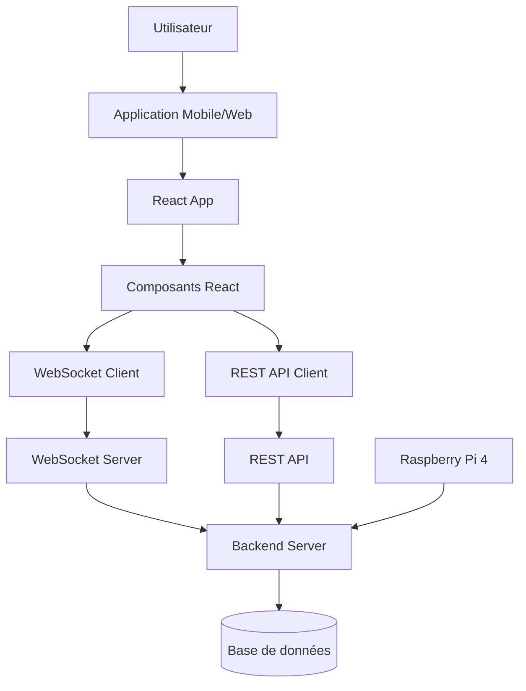

# Tricolo – Application Mobile & Dashboard

## 📱 Description du Projet

**Tricolo Frontend** est l'application web/mobile qui accompagne le système IoT intelligent de triage des déchets. Cette interface permet de visualiser en temps réel les données collectées par le Raspberry Pi, consulter les statistiques de tri, et suivre l'état des bacs de recyclage.

L'application offre un **tableau de bord interactif**, des **graphiques de statistiques**, et une **communication en temps réel** avec le système embarqué via WebSocket.

Ce projet est développé avec **React + Vite** dans un cadre **académique**, avec une architecture moderne et responsive.

---

## 🎯 Objectifs du Projet

- Afficher les données de tri en temps réel
- Visualiser les statistiques de recyclage
- Monitorer l'état des bacs (plein/disponible)
- Consulter l'historique des actions de tri
- Interface responsive (mobile et desktop)
- Communication temps réel avec le backend

---

## ✨ Fonctionnalités Principales

| Fonction | Description |
|--------|------------|
| Dashboard temps réel | Affichage des données IoT en direct |
| Statistiques de tri | Graphiques et métriques de recyclage |
| Monitoring des bacs | État de remplissage et alertes |
| Historique | Consultation des actions passées |
| Notifications | Alertes en temps réel (bac plein, etc.) |
| Interface responsive | Adaptation mobile et desktop |

---

## 🛠️ Spécifications Techniques

### 💻 Technologies Utilisées

| Technologie | Rôle |
|---------|------|
| React 18 | Framework frontend |
| Vite | Build tool et dev server |
| JavaScript/JSX | Langage de développement |
| WebSocket API | Communication temps réel |
| REST API | Récupération des données |
| CSS3 | Styling et animations |
| Chart.js / Recharts | Graphiques statistiques |

---

### 🌐 Communication Frontend ↔ Backend

| Type | Utilisation |
|----|------------|
| REST API | Récupération données, statistiques |
| WebSocket | Mise à jour temps réel |
| Format | JSON |

### Exemple de données reçues

```json
{
  "event": "waste_detected",
  "category": "recyclage",
  "timestamp": "2026-02-04T20:15:00",
  "binStatus": "available"
}
```

---

## 📂 Structure du Projet

```text
IOTFrontend/
├── index.html              # Point d'entrée HTML
├── package.json            # Dépendances et scripts
├── vite.config.js          # Configuration Vite
├── eslint.config.js        # Configuration ESLint
├── README.md               # Documentation
├── public/                 # Assets statiques
└── src/
    ├── main.jsx            # Point d'entrée React
    ├── App.jsx             # Composant principal
    ├── App.css             # Styles principaux
    ├── index.css           # Styles globaux
    ├── assets/             # Images, icônes
    └── components/
        ├── HomePage.jsx    # Page d'accueil/dashboard
        ├── Stats.jsx       # Composant statistiques
        ├── BinStatus.jsx   # État des bacs
        └── History.jsx     # Historique des actions
```

---

## 🚀 Installation et Utilisation

### Prérequis

- Node.js 16+ et npm
- Connexion au backend Tricolo

### Installation

```bash
# Cloner le repository
git clone <repository-url>

# Installer les dépendances
npm install
```

### Démarrage en développement

```bash
npm run dev
```

L'application sera accessible à `http://localhost:5173`

### Build de production

```bash
npm run build
```

### Prévisualisation du build

```bash
npm run preview
```

---

## 🌍 Déploiement

**Lien du déploiement actuel :**

```
https://iotfrontend-por1.onrender.com
```

### Plateformes supportées

- Render
- Vercel
- Netlify
- GitHub Pages

---

## 📐 Diagramme d'Architecture Frontend



---

## 🎨 Fonctionnalités à Venir

- [ ] Mode sombre
- [ ] Notifications push
- [ ] Export des statistiques (PDF/CSV)
- [ ] Personnalisation du dashboard
- [ ] Mode hors-ligne
- [ ] Support multilingue
- [ ] Authentification utilisateur
- [ ] Filtres avancés d'historique

---

## ⚠️ Limites du Projet

- Interface dépendante de la connexion au backend
- Pas d'authentification (version prototype)
- Données en temps réel limitées à une session
- Prototype académique non optimisé pour production à grande échelle

---

## 🔒 Sécurité et Confidentialité

- Communications via HTTPS/WSS en production
- Aucune donnée personnelle stockée côté client
- Données anonymisées à des fins statistiques
- Conformité aux standards de sécurité web modernes

---

## 📄 Licence

Projet distribué sous licence MIT.
